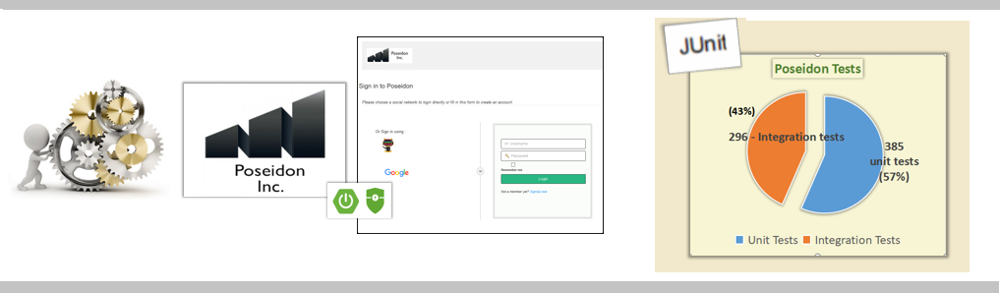
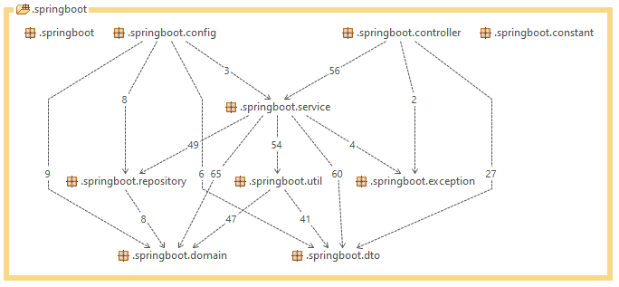

 

<h1></h1>

 

 

<table>
<tr>
<td>

</td>
<td>
<h3>What are the Significant features of this application?</h3>
<ul>
    <li>Developing Scaffolding code for Managing Entities for the Application backend</li>
    <li>APIs integrated with Token & Session Based Spring Security + OAuth / JWT authentication</li>
    <li>Successful Integration with static Thymeleaf Frontend facade</li>
    <li>Extensive TDD based development (681 tests, 385 Unit Tests & 296 Integration Tests)</li>
    <li>Implementing MVC principle on development design</li>
    <li>Adopting SOLID principle & evaluation with STAN2j</li>
    <li>Password encryption with JASYPT (Database, Oauth IDs & secrets) </li>
    <li>BCryptPassword Encoding user passwords persisted in database</li>
</ul>

</td>
</tr>
</table>
 

# PROJECT EXPECTATIONS
## Technical:

1. Framework: Spring Boot v2.0.4 ✔️
2. Java 8 ✔️
3. Thymeleaf ✔️
4. Bootstrap v.4.3.1 ✔️

## Setup with Intellij IDE / Eclipse
1. Create project from Initializr: File > New > project > Spring Initializr ✔️
2. Add lib repository into pom.xml ✔️
3. Add folders ✔️
    - Source root: src/main/java
    - View: src/main/resources
    - Static: src/main/resource/static
4. Create database with name "demo" as configuration in application.properties ✔️
5. Run sql script to create table doc/data.sql ✔️

## Implement a Feature
1. Create mapping domain class and place in package com.nnk.springboot.domain ✔️
2. Create repository class and place in package com.nnk.springboot.repositories ✔️
3. Create controller class and place in package com.nnk.springboot.controllers ✔️
4. Create view files and place in src/main/resource/templates ✔️

## Write Unit Test
1. Create unit test and place in package com.nnk.springboot in folder test > java ✔️

## Security
1. Create user service to load user from  database and place in package com.nnk.springboot.services ✔️
2. Add configuration class and place in package com.nnk.springboot.config ✔️

## STAN -Structural Analysis - Design metrics
===

### Authors

Mentee:  🡆   @Senthil

Mentor:  🡆   Clément SEZETTRE

### versions
Version:  🡆 1.0

### License
@OpenClassrooms & @Poseidon

Reference Documentation
===
For further reference, consider the following sections:

* [Official Apache Maven documentation](https://maven.apache.org/guides/index.html)
* [Spring Boot Maven Plugin Reference Guide](https://docs.spring.io/spring-boot/docs/2.5.4/maven-plugin/reference/html/)
* [Create an OCI image](https://docs.spring.io/spring-boot/docs/2.5.4/maven-plugin/reference/html/#build-image)
* [Spring Boot DevTools](https://docs.spring.io/spring-boot/docs/2.5.4/reference/htmlsingle/#using-boot-devtools)
* [Validation](https://docs.spring.io/spring-boot/docs/2.5.4/reference/htmlsingle/#boot-features-validation)
* [Spring Boot Actuator](https://docs.spring.io/spring-boot/docs/2.5.4/reference/htmlsingle/#production-ready)
* [Spring Data JPA](https://docs.spring.io/spring-boot/docs/2.5.4/reference/htmlsingle/#boot-features-jpa-and-spring-data)
* [Spring Security](https://docs.spring.io/spring-boot/docs/2.5.4/reference/htmlsingle/#boot-features-security)
* [Thymeleaf](https://docs.spring.io/spring-boot/docs/2.5.4/reference/htmlsingle/#boot-features-spring-mvc-template-engines)
* [Spring Web](https://docs.spring.io/spring-boot/docs/2.5.4/reference/htmlsingle/#boot-features-developing-web-applications)
* [STAN DOCUMENTATION WHITE PAPER](http://stan4j.com/papers/stan-whitepaper.pdf) 

Reference Guides
===
The following guides illustrate how to use some features concretely:

* [Building a RESTful Web Service with Spring Boot Actuator](https://spring.io/guides/gs/actuator-service/)
* [Accessing data with MySQL](https://spring.io/guides/gs/accessing-data-mysql/)
* [Accessing Data with JPA](https://spring.io/guides/gs/accessing-data-jpa/)
* [Securing a Web Application](https://spring.io/guides/gs/securing-web/)
* [Spring Boot and OAuth2](https://spring.io/guides/tutorials/spring-boot-oauth2/)
* [Authenticating a User with LDAP](https://spring.io/guides/gs/authenticating-ldap/)
* [Handling Form Submission](https://spring.io/guides/gs/handling-form-submission/)
* [Building a RESTful Web Service](https://spring.io/guides/gs/rest-service/)
* [Serving Web Content with Spring MVC](https://spring.io/guides/gs/serving-web-content/)
* [Building REST services with Spring](https://spring.io/guides/tutorials/bookmarks/)
* [STAN Structure Analysis for Java](http://stan4j.com/)
